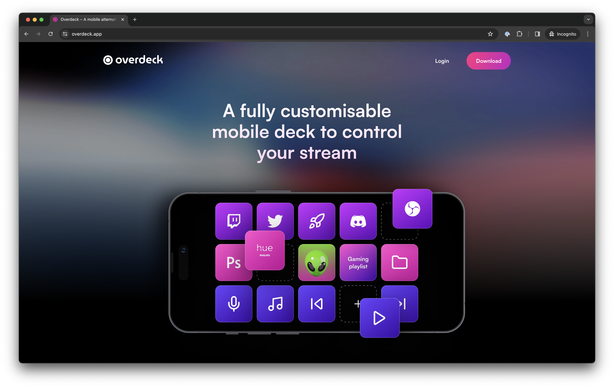

# Snowflakes Overlay

> Bring the xmas vibe to your stream!


## Sponsor

This overlay is sponsored by [Overdeck](https://overdeck.app).

Overdeck is a fully customisable mobile deck to control your stream. [Download now](https://overdeck.app/downloads) for free!



## How to use

1. Go to your OBS or similar software
1. Create a Browser source on your scene
1. In the URL, add `https://snowflake-overlay.vercel.app/`
1. Set the `Width` and `Height` to match your stream resolution. For example, if you stream in ` 1920x1080``, your  `Width`will be`1920`and your`Height`will be`1080`.
1. Leave the rest as is.

**🔥 TIP**: Don't stretch your overlay! Set the `Width` and `Height` correctly instead for better results.

## Customization

You can customise the following values via URL parameters:

1. Number of snowflakes
1. Speed
1. Wind force
1. Snowflake size

### `flakes`

Set the number of flakes to be rendered.

Default: `300`
Max: `1000` for performance reasons.

If it's too slow, set a smaller value.

#### Example

To set `100` flakes: `https://snowflake-overlay.vercel.app/?flakes=100`

### `speed`

Set the speed the flakes will fall. The higher the number, the faster the flake will fall.

Default: `0.5`

You can also set decimal values such as `0.1`, `0.5`, `2.3`, etc.

#### Example

Slower animation: `https://snowflake-overlay.vercel.app/?speed=0.1`
Faster animation: `https://snowflake-overlay.vercel.app/?speed=3`

### `wind`

Set the force of the wind. From left to right. The higher the number, the faster the force of the wind.

Default: `1`

You can also set decimal values such as `0.1`, `0.5`, `2.3`, etc.

#### Example

Slower animation: `https://snowflake-overlay.vercel.app/?wind=0.5`
Faster animation: `https://snowflake-overlay.vercel.app/?wind=3`

### `size`

The size factor for the snowflakes. It's used as based, the final size varies. The higher the number, the larger the final size of the snowflake will be.

Default: `1`

You can also set decimal values such as `0.1`, `0.5`, `2.3`, etc.

#### Example

Smaller snowflakes: `https://snowflake-overlay.vercel.app/?size=0.5`
Bigger snowflakes: `https://snowflake-overlay.vercel.app/?size=3`

### All together

If you are not familiar on setting up URL parameters, you can copy the URL above and play with the values.

```
https://snowflake-overlay.vercel.app/?flakes=300&speed=1&wind=1&size=1
```

---

Don't forget to check out Overdeck. [Download now](https://overdeck.app/downloads) for free!
